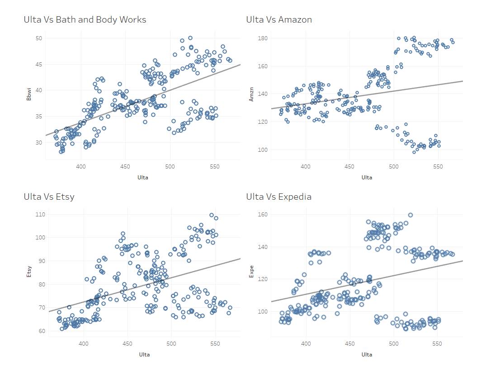

# Applying Multiple Regression to Predict ULTA’s Closing Stock Price Using Adjacent Stocks in Consumer Discretionary Components in the S&P 500

**John I. Anderies, April 2024**

## Abstract

This report aims to use multiple regression to predict Ulta Corporation's closing stock price using the closing stock price of other companies in the consumer discretionary components list from the S&P 500. For the development of the model, SAS was used supplemented with Tableau for visualizations. The first step of this analysis was to use stepwise regression on different stocks from companies that were considered to have a similar consumer base as Ulta and therefore might help predict the stock price. These stocks are as follows: Amazon, Bath & Body Works, Etsy, Expedia Group, Lululemon, Marriott International, MGM Resorts, Nike, Pool Corporation, Ralph Lauren Corporation, Starbucks, Tapestry, Inc., Wynn Resorts, Ross Stores, Royal Caribbean, and Yum! Brands. Stepwise regression was then applied to these variables and returned the first-order model with the highest R-squared. The model included these variables; Bath and Body Works, Amazon, Etsy, Lululemon, Marriott, Nike, Ralph Lauren, Tapestry, Wynn Resorts, and Yum Brands.

The next step in the regression process was to check for multicollinearity. This was done using the Variance Inflation Factor (VIF) of all independent variables. Models were tested by removing high VIF variables and then re-running the model to see if the removed variable was the cause of the inflation. The final model that had VIF values all below the desired cut-off of 10 was: Bath and Body Works, Etsy, Lululemon, MGM, Nike, Ralph Lauren, Wynn Resorts, and Yum Brands. 

The next step was to add second-order terms, with all 10 original variables being tested as second-order terms. This test was done through an F-test of the second-order terms. The F-test came back significant meaning that at least one of the second-order coefficients was significant. All t-tests for second-order terms were examined and three were found to be insignificant: Ralph Lauren, Lululemon, and Yum! These terms were removed and the model's performance did not change. The next step was to look at interaction terms, with Lululemon and Nike, as well as MGM and Wynn Resorts, being selected as two interaction terms given they cover very similar markets. These terms were tested with interaction plots. When added to the model, they increased the R-squared adjusted and both had significant t-tests. These terms were added to the final model giving the following:

E(Ulta) = -992.65411 + 26.25259(BBWI) + 3.44117(LULU) + 28.82128(MGM) - 5.79296(NKE) + 1.60998(RL) - 9.22255(WYNN) + 0.58940(YUM) - 0.332676(BBWI^2) + 0.58108(MGM^2) + 0.09340(NKE^2) + 0.22493(WYNN^2) - 0.03203(LULU * NKE) - 0.80242(MGM * WYNN)

Residual analysis was then done to ensure that the assumptions of equal variances and normality hold true. The residual versus predicted, fit-mean, Cook's D, and histogram of the residuals all showed the expected behaviors that support these assumptions which are necessary for regression validity. The overall R-squared adjusted was 0.91, which means that 91% of the variation in Ulta’s stock price was accounted for by the model. All metrics of performance were met, meaning that this model is performing well and is trustworthy.

The next steps for this model would be to explore all of the relevant interaction terms and incorporate them into the model to see what effect they might have on improving the overall performance. Once this is checked, more stocks that relate to Ulta’s consumer base outside of the Consumer Discretionary Components could be brought in to see if they help with predictions.

## Exploratory Data Analysis

There are 52 stocks in this dataset from the Consumer Discretionary Components in the S&P 500. I selected Ulta, which is a cosmetic retail chain that specializes in beauty products. I thought it would be interesting to explore what other stocks are linked to the performance of Ulta stock as it seems like a fairly stable market that doesn't have much competition outside of large retailers that don’t necessarily specialize in beauty products. While there are 51 other variables that I could have chosen for this analysis, I chose to look at stocks of companies that are related to either retail or lifestyle and fashion as it would seem that these cover the same market and therefore would be useful in predicting Ulta’s stock price. I also threw in Starbucks as every time I have been to an Ulta I have seen a vast majority of people in the store drinking Starbucks so maybe there is a connection through the type of consumers for both companies.

The stocks that I selected are as follows: Amazon, Bath & Body Works, Inc., Etsy, Expedia Group, Lululemon Athletica, Marriott International, MGM Resorts, Nike, Inc., Pool Corporation, Ralph Lauren Corporation, Starbucks, Tapestry, Inc., Wynn Resorts, Ross Stores, Royal Caribbean, and Yum! Brands. All of these companies fall into either entertainment, fashion, luxury, or lifestyle which are all adjacent to the products that Ulta sells.

Firstly, let's look at the trends of all of the stocks over the given timeframe. We can see in Fig 1.1 the closing prices of each day from April 2023 to March 2024. The stocks that are in Fig 1.1 are Ulta, Bath and Body Works, Etsy, and Amazon. We can see that for all stocks except Amazon, there is a distinct drop around early November. This drop is seen in Amazon, but it is much less significant when compared to the other three stocks.

Fig. 1.1

The next set of stocks are Expedia, Lululemon, Marriott, and MGM Resorts. We see a similar pattern with distinct drops around early November in Expedia and MGM, while in Lululemon and Marriott we see pretty consistent growth across the year. There is an interesting spike around February in Expedia's stock where the price quickly drops and then stabilizes, this could be due to a stock split but more investigation would be needed to confirm that.

Fig. 1.2

The next set of stocks we have in Fig 1.3 are the Pool Corporation, Ralph Lauren, Ross Stores, and Nike. There aren’t any crazy patterns that would stand out, we see the drop in prices around November in the Pool corporation, and early October in Nike but Nike's stock quickly shoots back up during December which makes sense given they are a very popular brand for fashion as well as a lifestyle over the holidays. Apart from that Ralph Lauren has had steady growth from their lowest point in late October with a large jump around March of 2024. Ross stores has a very similar pattern with the stock price steadily growing since October.  Overall no unexpected patterns or extreme outliers.

Fig. 1.3

In Fig 1.4 we have Royal Caribbean, Starbucks, Tapestry Inc., and Wynn Resorts.  For Wynn Resorts we see a pattern of very high stock prices during the summer months a steady decline leading into the holidays and then a resurgence at the beginning of the new year. For Starbucks, it goes against the trend of being at its lowest in November and has a large spike just at the beginning of November (probably a byproduct of the legendary pumpkin spice latte becoming available at this time).  There is an interesting trend with Tapestry Inc. as there is a huge drop starting around August which hits a low around November, I am not sure what could have caused this but it might be an outlier during that time stretch. 

Fig. 1.4

The last stock in our initial variable pool is Yum! Which is a fast-food corporation that owns many large restaurant brands. As seen in Fig 1.5 its performance also has that distinct drop around November but overall is fairly steady with no strange patterns.

Fig. 1.5

Overall the stocks selected share common behaviors and don't seem to have any wild stock fluctuations apart from the fairly consistent drop in November. Overall the sample of stocks we have covers a lot of industries that relate to luxury lifestyle, travel, and fashion which I think are all related to Ulta's primary market and therefore should be able to predict its stock price given a set combination of stocks.

## Methodology

For the development of this model, SAS was used, primarily Proc reg for analyzing multiple regression as well as for the variable selecting methods for R-squared, R-squared adjusted, and Cp. Proc GLMselect was also used for variable selection regarding the PRESS statistic. Proc GLM and PLM were used to identify interaction terms through interacting plots and all hypothesis tests for second-order terms were done through the Proc reg test statement. For the visualization of the correlation between different variables and the time series visualizations of the different stocks, Tableau was used.

## Correlation Analysis

To assess the contribution of variables, we examined correlations between the dependent variable and potential independent variables. This analysis helps identify which variables are highly correlated with each other, aiding in better prediction of the dependent variable. The Proc Corr function in SAS was used for this analysis, yielding the following results. In Fig 2.1, seven variables exhibit correlation coefficients above 0.5, while the remainder are below 0.5, with Starbucks showing the lowest coefficient at 0.15.

Fig. 2.1

We can see that the trend line shows us a positive correlation for all of the variables with the 2 strongest correlations being that of Bath and Body Works and Etsy. Amazon has an interesting pattern where after Ulta hits 500 per share we see a fork on either side of the trend line which is a strange behavior that might cause it to not be a good variable for predicting the higher values of Ulta stock price.

Fig. 2.2

In Fig 2.2 we can see that the trend in the correlation between Ulta and other lifestyle brands continues. We see the same forking pattern in Marriott that we see in Amazon meaning that we might not want to use it as a predictor of Ulta. Another strange trend we see is that of MGM resorts where there is a quadratic shape to the data, this indicates that using a squared term for MGM might yield better results overall in the modeling process. Lululemon has an interesting pattern where it seems to spread out on either side of the trend line as Ulta stock price increases.

Fig. 2.3

In Fig 2.3 we see more of the fork pattern in Tapestry Inc. and Ralph Lauren. 
Overall the rest follow a decent correlation with Ulta and don't have any strange patterns. In Fig 2.5 below we can see that for Ross stores there is a dramatic fork in as Ulta stock price gets into the higher ranges.

Fig. 2.4

Overall the fork pattern is most likely due to the lurking variable that is time given the data is time series so over a given period fluctuations at different times could lead to data points on either side of the trend line. There is a positive correlation in all of the variables with Ulta, but this could be just due to market conditions so the correlation alone isn’t enough meaning that further regression analysis is required.

## Variable Selection

After reviewing the raw data and ensuring there are no outliers or unusual behaviors, we employed advanced techniques for variable selection in the regression model. The first technique used was stepwise regression, which evaluates all possible combinations of variables and selects the model with the best overall performance. From the initial 14 independent variables, the resulting model identified by stepwise regression includes Bath and Body Works, Amazon, Etsy, Lululemon, Marriott, Nike, Ralph Lauren, Tapestry, Wynn Resorts, and Yum Brands. This initial step eliminated 4 variables from the initial pool.

The next step involved checking for multicollinearity, where two variables contribute redundant information. This was assessed using the Variance Inflation Factor (VIF), with the criterion that all VIF values should be less than 10. The Proc reg command in SAS was used to compute the VIF for all independent variables.

We can see that the highest VIF is 26.9 for Marriott so to fix this we need to remove this variable and re-run the model again.

Removing Marriott had a very small effect on the overall VIFs of the model so we are going to add it back and remove the second-highest VIF to see if that is the variable causing the Inflation. The second-highest of the original was Amazon.

We see that just removing Amazon didn't have much of an effect therefore the next step is to remove both of the variables and re-run the model.

Removing both variables has reduced the VIF of most of the original high values but there are still a few that are above the boundary with Tapestry Inc. being the highest. The next step is to remove it and re-run the model.

That did the trick! we now have the best-performing first-order model that has VIFs all below the threshold of 10 meaning that we do not have severe multicollinearity.

# Regression Analysis

Now, to determine the final first-order model to be regressed, four different metrics will be used to identify the best overall model. These metrics are R-squared, R-squared adjusted, predicted residual error sum of squares (PRESS), and Cp statistic. 

In the table below, all four selection criteria were used to find the most parsimonious model with the best predictive power.

| Metric Used | Model | R²   | R²-adj | CV  | MSE   |
|-------------|-------|------|--------|-----|-------|
| R²          | E(Ulta) = -428.14066 + 1.457(Yum) + 0.26232(Lulu) + 2.80312(Wynn) -3.03522(MGM) + 2.33971(NKE) + 0.82933(RL) + 2.29631(BBWI) | .8502 | .8458 | 4.54 | 465.82 |
| PRESS       | E(Ulta) = -407.86918 + 2.14258(BBWI) + 0.31646(ETSY) + 0.28010(LULU) - 3.37789(MGM) + 2.06617(NKE) + 0.86693(RL) + 2.74372(WYNN) + 1.44195(Yum) | .8508 | .8458 | 4.54 | 447.71 |
| CP          | E(Ulta) = -428.14066 + 2.29631(BBWI) + 0.26232(Lulu) -3.03522(MGM) + 2.33971(NKE) + 0.82933(RL) + 2.80312(Wynn) + 1.457(Yum) | .8502 | .8458 | 4.54 | 447.76 |
| R²-Adj      | E(Ulta) = -407.86918 + 2.14258(BBWI) + 0.31646(ETSY) + 0.28010(LULU) - 3.37789(MGM) + 2.06617(NKE) + 0.86693(RL) + 2.74372(WYNN) + 1.44195(Yum) | .8508 | .8458 | 4.54 | 447.71 |

Overall, the selection criteria arrived at very similar models, with R-squared and Cp returning the same model, and PRESS and R-squared adjusted returning the same model. The R-squared adjusted for all of the models is the same, and the CV is the same. The only thing that varies between the models is the MSE and R-squared, but the difference is so small it is negligible. Therefore, the model that will be selected is the one with the fewest variables, meaning it is the most parsimonious model. The model that will be moving forward is the one selected by Cp and R-squared, as it has one fewer variable than the other model but has the same performance.

The next step in this analysis is to add some second-order terms to see if they add predictive power to the model. We can do this by using an F-test for all of the second-order term coefficients and testing whether at least one of them is non-zero.

**H0:** β₉ = β₁₀ = β₁₁ = β₁₂ = β₁₃ = β₁₄ = β₁₅ = 0  
**Ha:** At least one is non-zero.

When we perform this test using SAS we get the following output.
The p-value is significant which means that there is sufficient evidence to reject the null hypothesis and say that at least 1 of the coefficient of the square terms is non-zero. When we run the regression with all of the square terms we get the following output. 

Given that 3 of the second-order terms are non-significant(as denoted by the p-value in the far right column) we can remove them and re-run the model.

After removing the insignificant variables the model R-squared is .8882 which is a jump of almost 4% from the original first-order model. The next thing that could add some predictive power to the model is interaction terms, due to the scope of this project testing all of the interaction terms is not possible but I will test 2 interaction terms and see how they affect the model's performance. The 2 interaction terms I am testing are Nike and Lululemon as they are closely related in the type of products they produce i.e. sportswear, the second pair will be MGM Resorts and Wynn Resorts as again they cover the same customer base and potentially interact. To test whether or not there is an interaction we can use the built-in interaction plot in SAS. The interaction plot shows how one independent variable changes the prediction of the dependent variable as another independent variable also varies. If there is no interaction then the line produced should all have the same slope and directions. The output for both interaction terms is shown below.

 

We can see that in both plots there is a clear change in prediction from one variable given a change in the other showing that there is an interaction between the two variables when predicting the dependent variable. This indicates that adding these interaction terms to the model might help improve the performance as there is an interaction-type relationship.

As we can see both of the interaction terms are statistically significant and therefore are kept in the model. Once we add the 2 interaction terms to the model we get the following complete model. 

E(Ulta) = -992.65411 + 26.25259(BBWI) + 3.44117(LULU) + 28.82128(MGM) -5.79296(NKE) + 1.60998(RL) - 9.22255(WYNN) + 0.58940(YUM) -0.332676(BBWI^2) + 0.58108(MGM^2) + 0.09340(NKE^2) +0.22493(WYNN^2) -0.03203(LULU*NKE) -0.80242(MGM*WYNN)

For all independent variables including all of the interaction and second-order terms, they are statistically significant. The summary statistics for the model are also all satisfactory with an adjusted R-squared of 0.9104 meaning that the model accounts for 91% of the variation in Ulta stock price. We can also see that the coefficient of variation is below the threshold of 10 which is desired.
Now that we have our final model we need to check the residuals to ensure that the assumption of equal variances and normality holds true as it is required for the regression model to be valid.

# Residual Analysis

For the residual analysis, we need to ensure that the residuals have equal variances, as this is one of the key assumptions of linear regression. If this assumption is not met, the model cannot be used. To check for equal variances, we can use the residuals vs. predicted plot and inspect it for any patterns.

## Residuals vs. Predicted Plot

The residuals vs. predicted plot helps us visualize whether the residuals exhibit any systematic patterns. In an ideal scenario, the residuals should be randomly scattered around zero with no discernible pattern. If patterns are present, it suggests issues with equal variance (homoscedasticity) and could indicate that the model assumptions are violated.

- **Random scatter**: Indicates homoscedasticity, meaning the residuals have equal variances.
- **Patterns or funnel shapes**: Indicate heteroscedasticity, meaning the residuals do not have equal variances and the model may be inappropriate.

By examining this plot, we can determine whether the assumption of equal variances holds and thus decide on the validity of our regression model. 

Starting with the residual vs predicted values(top left), there don’t seem to be any patterns and the points are scattered which is what we would expect given equal variances so the assumption holds. Moving to the Q-Q plot (middle left), we can check for the normality of the residuals. We expect the points to lie along a straight line given that the variances are normal, we do indeed see this pattern with some variance at the extremes which is to be expected. The pattern indicates that the variances are normally distributed which can be seen in the residual histogram (bottom left) which is normally distributed. The Fit-Mean plot shows that the spread of the residuals is small when compared to that of the fitted values. Looking at the Cook’s D plot we see that while some values are of high influence on the beta predictions, overall most singular data points don’t influence the model at large. Overall the residuals all look normal supporting the assumption of equal variance meaning that we can approve the model for further use as it meets all of the requirements needed to be considered a valid model.

# Conclusion and Next Steps

Now that we have ensured equal variances for the model, we can use the model below.

\[ E(Ulta) = -992.65411 + 26.25259(BBWI) + 3.44117(LULU) + 28.82128(MGM) -5.79296(NKE) + 1.60998(RL) - 9.22255(WYNN) + 0.58940(YUM) -0.332676(BBWI^2) + 0.58108(MGM^2) + 0.09340(NKE^2) +0.22493(WYNN^2) -0.03203(LULU*NKE) -0.80242(MGM*WYNN) \]

For all of the coefficients in the model, the practical interpretations in the context of the data are as follows, assuming all other variables are held constant:

- **Intercept**: When all other stocks are 0, the expected value of ULTA's stock price is -992.65.
- **Bath and Body Works (BBWI)**: For every increase of one dollar in BBWI's stock price, Ulta’s expected stock price increases by 26.25 dollars.
- **Lululemon (LULU)**: For every increase of one dollar in LULU's stock price, Ulta’s expected stock price increases by 3.44 dollars.
- **MGM Resorts (MGM)**: For every increase of one dollar in MGM's stock price, Ulta’s expected stock price increases by 28.82 dollars.
- **Nike (NKE)**: For every increase of one dollar in NKE's stock price, Ulta’s expected stock price decreases by 5.79 dollars.
- **Ralph Lauren (RL)**: For every increase of one dollar in RL's stock price, Ulta’s expected stock price increases by 1.61 dollars.
- **Wynn Resorts (WYNN)**: For every increase of one dollar in WYNN's stock price, Ulta’s expected stock price decreases by 9.22 dollars.
- **Yum! Brands (YUM)**: For every increase of one dollar in YUM's stock price, Ulta’s expected stock price increases by 0.59 dollars.
- **Bath and Body Works squared (BBWI²)**: Every increase of one dollar in BBWI²'s stock price decreases Ulta’s expected stock price by 0.33 dollars.
- **MGM Resorts squared (MGM²)**: Every increase of one dollar in MGM²'s stock price increases Ulta’s expected stock price by 0.58 dollars.
- **Nike squared (NKE²)**: For every increase of one dollar in NKE²'s stock price, Ulta’s expected stock price increases by 0.09 dollars.
- **Wynn Resorts squared (WYNN²)**: Every increase of one dollar in WYNN²'s stock price increases Ulta’s expected stock price by 0.22 dollars.
- **Interaction term LULU*NKE**: Every increase of one dollar in the combined stock price of LULU and NKE decreases Ulta’s expected stock price by 0.03 dollars.
- **Interaction term MGM*WYNN**: Every increase of one dollar in the combined stock price of MGM and WYNN decreases Ulta’s expected stock price by 0.8 dollars.

Overall, the model performs well with an adjusted R-squared of 0.91, meaning that 91% of the variability of Ulta's stock price is accounted for by the model. The model's residuals support the assumption of equal variance as well as the normality of the residuals.

The next steps for the model would be to investigate all remaining interaction terms to see if adding more would make the model more effective in predicting Ulta’s stock price. Additionally, starting with more potential independent variables in the initial variable selection might lead to better models emerging from the raw data rather than selection based on a shared customer base as in this analysis. This approach would take more time than this report was allotted but is fully possible if development is continued. The current state of the model is very accurate, with all key statistics performing well and all pitfalls checked for in the modeling process. To test the effectiveness of the model, it should be used on an out-of-sample data set to see how it performs on new data, as this would validate the model if it performs well.

